

# Blaze Advisor <button onclick="window.open('https://www.fico.com/br/products/fico-blaze-advisor-decision-rules-management-system');">FICO</button>

O Blaze Advisor é um software da empresa FICO que busca tornar as tarefas de decisões de negócios mais eficientes. Em sua página oficial, a FICO caracteriza o Blaze como: 
>"[...] uma solução escalável que proporciona agilidade e capacidade de ação sem precedentes a empresas de vários setores para tomadas de decisão mais inteligentes, transparentes e justificáveis". 

Ainda em sua caracterização:

>"[...] com diversos métodos para o desenvolvimento, criação e teste de regras, incluindo árvores de decisões, scorecards, tabelas de decisões, fluxos gráficos de decisões e templates personalizados". 

### Instalações
Os arquivos para instalação utilizados foram: 
1. java jdk-8u221
2. blaze-advisor_7.5
3. Eclipse (utilizei um eclipse executavel -> 'eclipse-jee-oxygen-3a-win32-x86_64' que é a versão Oxygen de 2018) mas você pode utilizar a sua versão de preferência.

Instale o java:

    
jdk-8u221-windows-x64 (JAVA)

Obs: fique atento ao local em que o programa está sendo instalado. No meu caso, ele está na seguinte pasta: **C:\Program Files\Java**

-------------------------
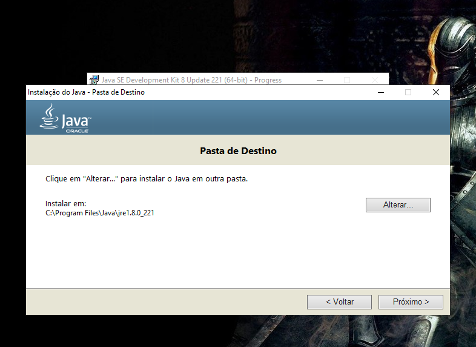

------------------------

Instale o blaze: (software obtido nos canais oficiais da FICO)

    
blaze-advisor_7.5.7500.v11760_Windows (Blaze)

Obs: novamente fique atento ao local onde o programa está sendo instalado. No meu caso, ele está na seguinte pasta: C:\Blaze. 

Criar uma pasta **projetos** em C:\Blaze e copiar(Desempacotar) o arquivo **eclipse-jee-oxygen-3a-win32-x86_64.zip** para dentro desta pasta.

-------------------------
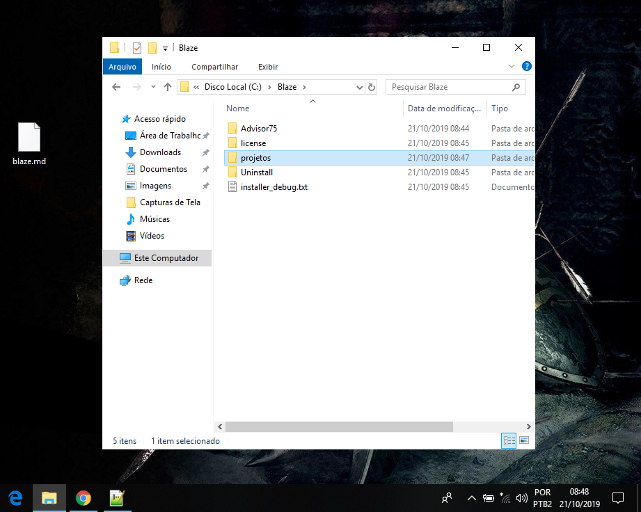
				
-------------------------

Renomear a pasta **eclipse-jee-oxygen-3a-win32-x86_64** para **eclipse01** para facilitar a localização. 		

-------------------------
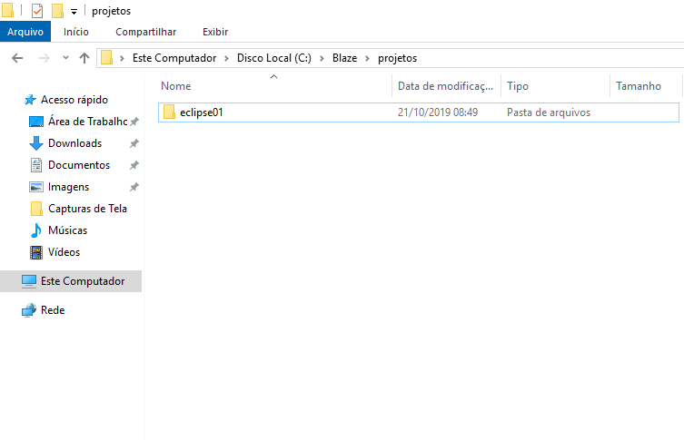

-------------------------
				
Executar, com um duplo clique, o arquivo **eclipse.exe** que está dentro da pasta eclipse01 (pasta renomeada). 

-------------------------
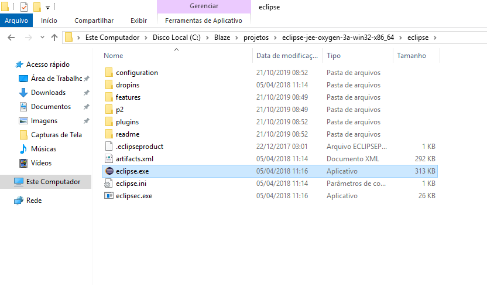		

-------------------------

**IMPORTANTE:** escolher o workspace do eclipse. Você deverá escolher um workspace fácil de lembrar. 
No meu caso, escolhi a própria pasta do eclipse. **C:\Blaze\projetos\eclipse01\eclipse-workspace**

Instalar o plug-in do Blaze: após abrir o eclipse e escolher o workspace, devemos preparar o eclipse para suportar o Blaze. 

- No eclipse, ir em: Help - Install new software.

-------------------------
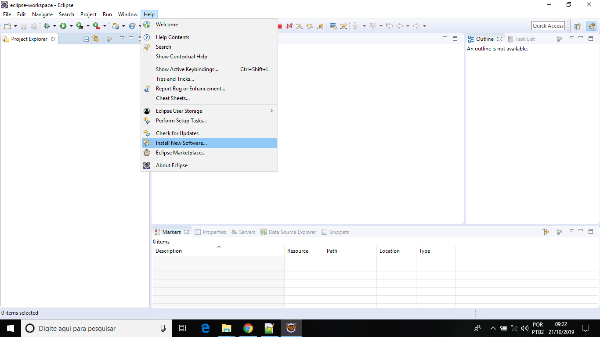

-------------------------

				
- Add - local.

-------------------------

-------------------------

- Ir na pasta C:\Blaze\Advisor75\EclipsePluginUpdateSite 
	
-------------------------
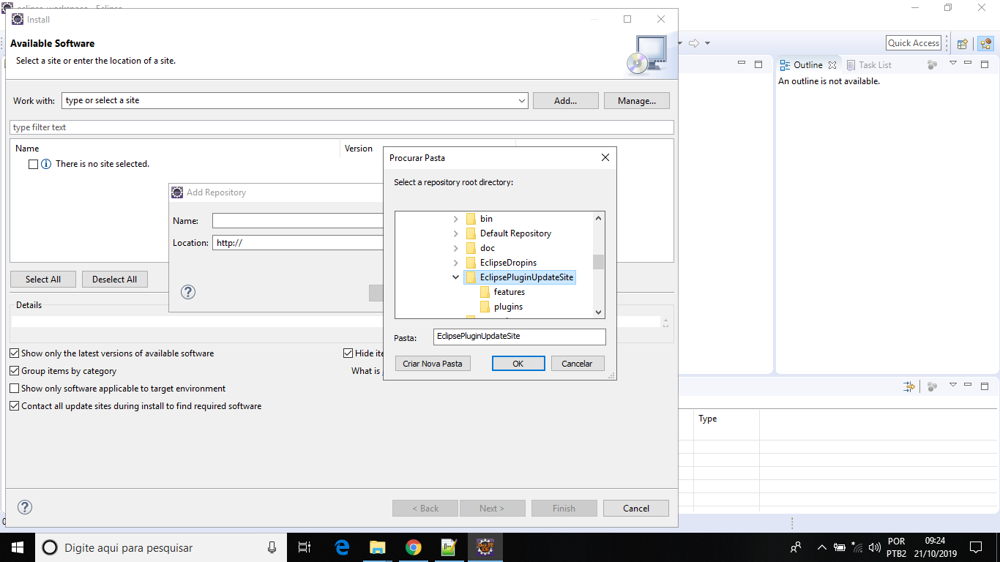

-------------------------
	
- Depois de selecionar a pasta, digitar **Blaze Advisor** e clicar em ok.

-------------------------
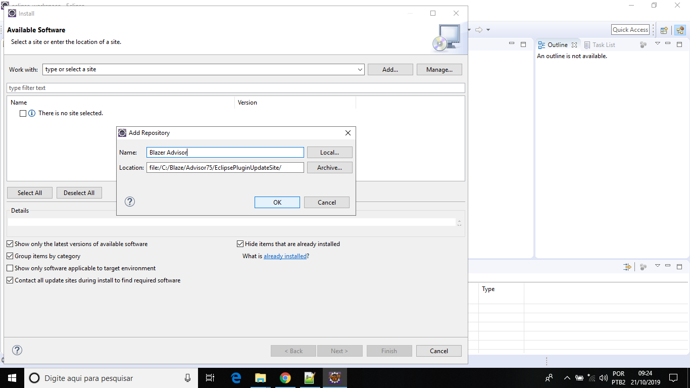

-------------------------

- Selecionar **Blaze Adivisor** e **Blaze Advisor Optional**. Ir clicando em next até terminar a instalação e reiniciar o eclipse. 

-------------------------
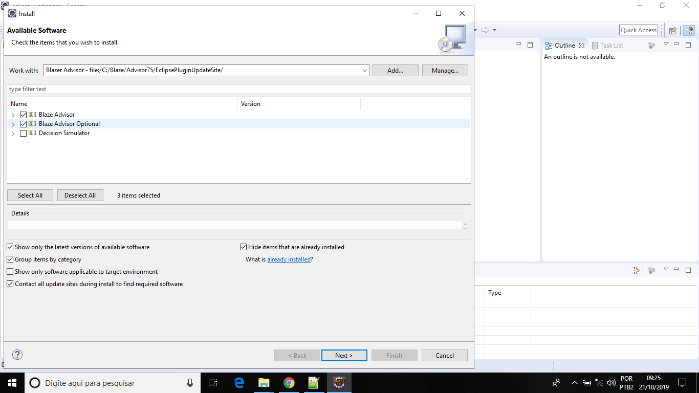

-------------------------

	
Para utilizar o plug-in do Blaze:

- Ao reiniciar, o blaze irá pedir uma licença que pode ser adquirida com a FICO. <button onclick="window.open('https://marketplace.ficoanalyticcloud.com/apps/134263#!overview');">FICO</button>

- Após colocar a licença, basta ir em: Window - Perspective - Open Perspective - Other.

-------------------------
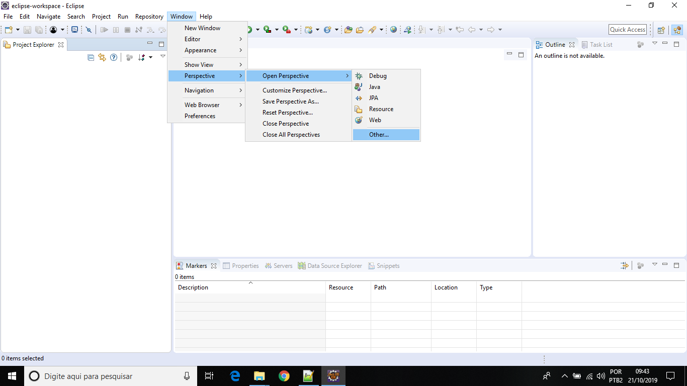

-------------------------

- Blaze Advisor - Open.

-------------------------
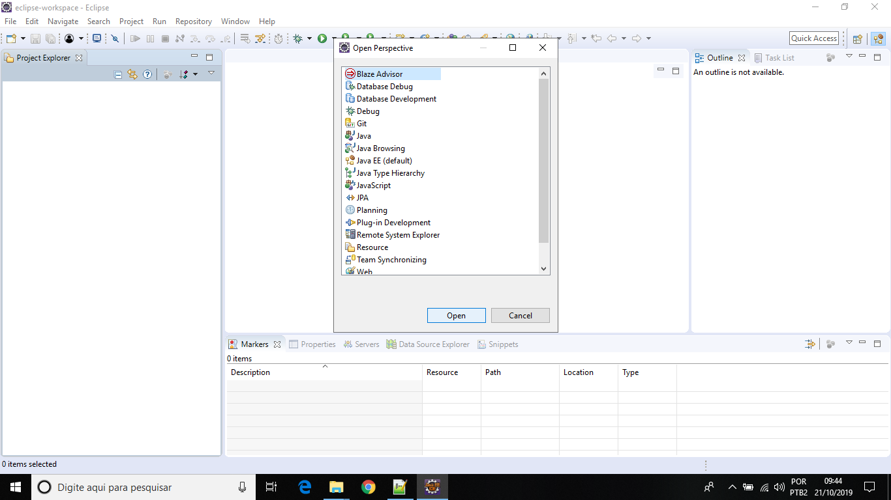

-------------------------

## Criando Repositório 

Todo nosso ambiente será preparado na pasta 

> C:\Blaze\projetos

Crie uma pasta com o nome **repositorio01** em C:\Blaze\projetos

-------------------------
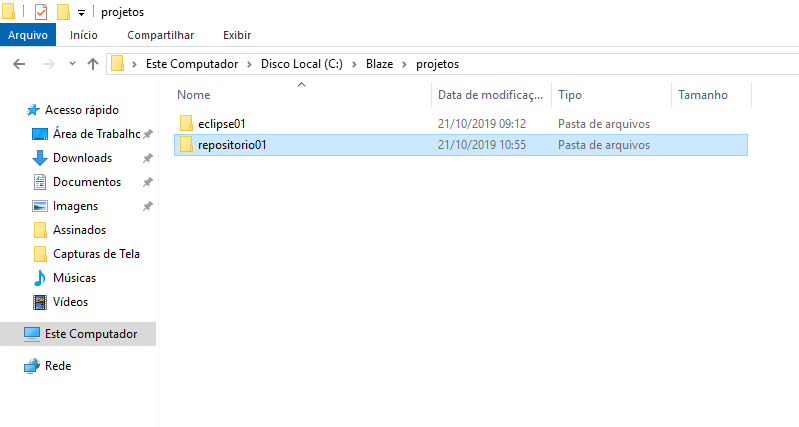

-------------------------

O repositório no Blaze pode ser versionado ou não versionado. 
Neste tutorial, iremos utilizar o sistema de versionamento do Blaze (bvs). 
Este sistema de versionamento funciona com base em duas partes, uma denominada Central e outra Admin. 
A parte central mantém um histórico de tudo que for feito no Blaze e a parte Admin é o usuário criado para gerenciar o repositório/projeto. 

Crie, dentro da pasta repositório, as seguintes pastas:

- bvs-central
- bvs-admin 
- workspaces
				
				
-------------------------
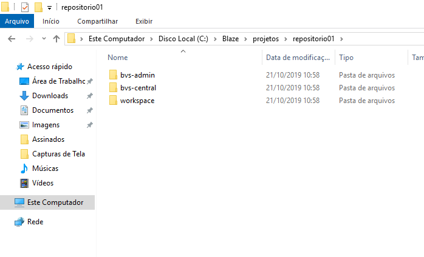

-------------------------				
				
Iniciando o repositório no eclipse:

- Após criar as pastas necessárias para o início do nosso projeto, iremos voltar ao eclipse e fazer o seguinte:

	- Ir na aba Repository - New Repository [Novo Repositório] 

	-------------------------
	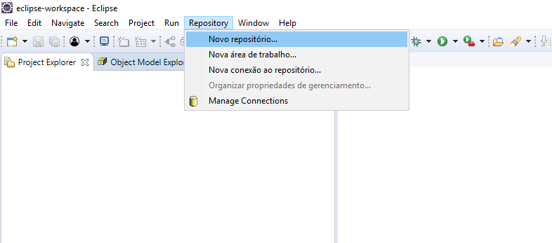

	-------------------------

	- Escolher um nick name [Apelido] para o repositório. No meu caso escolhi: **RepositorioCarro**

	- Escolher um Repository Type [Tipo de Repositório]: repositório de Arquivos **(Controle de Versão de BVS - Privado)**.

	- Ainda nesta janela, você deverá referenciar as pastas bvs-admin e bvs-central que você criou.

	- Como nas imagens abaixo, você deverá referenciar a pasta bvs-central primeiro e logo abaixo referenciar a pasta bvs-admin.

	- Colocar admin como usuário nas duas opções. Para este tutorial não será necessário utilizar senha. 
	
-------------------------
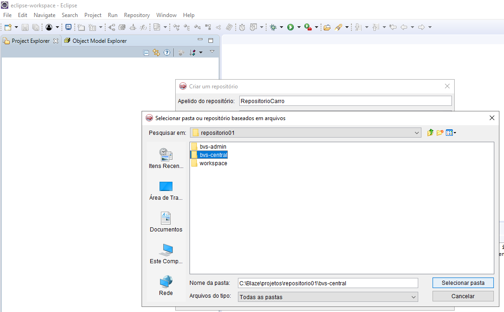

-------------------------			

-------------------------
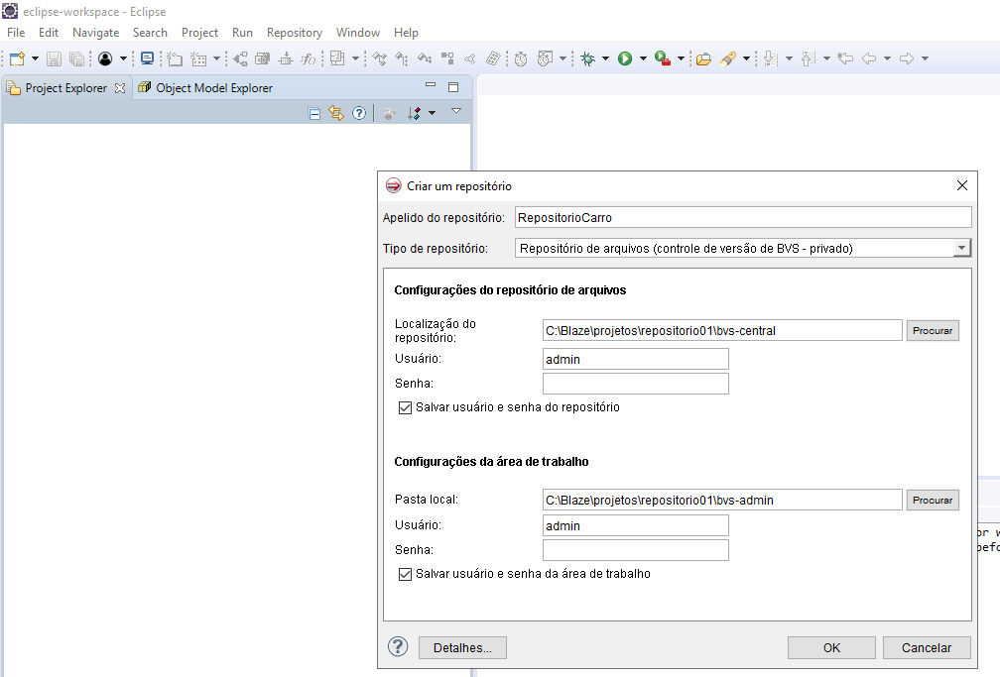

-------------------------				
				

## Criando um projeto

Iremos trabalhar com um projeto dividido de acordo com a seguinte estrutura: 
	
	> Technical - Business - Testing - Decision Services
	
Cada parte será um subprojeto e terá funções específicas que serão discutidas mais a frente. 

Para iniciar, iremos criar a parte Technical do projeto:

- Ir na aba File - New - Project

-------------------------
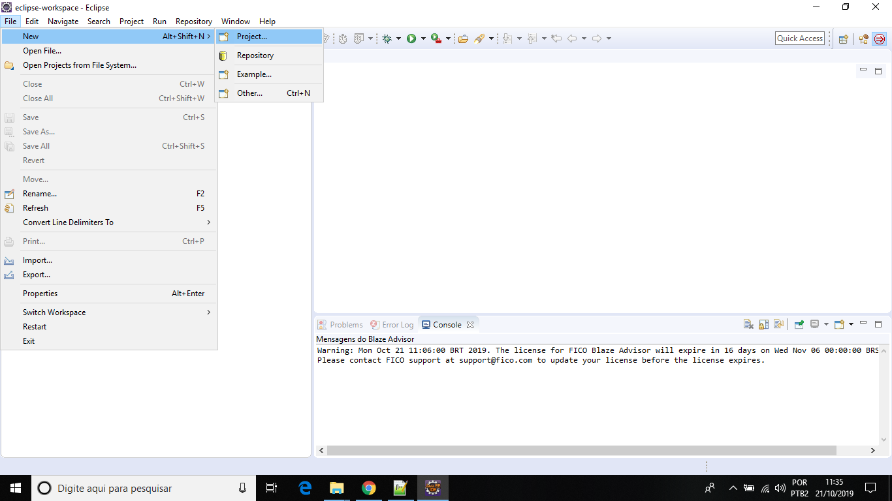

-------------------------

- Blaze Advisor - Rule Project - Next 

-------------------------
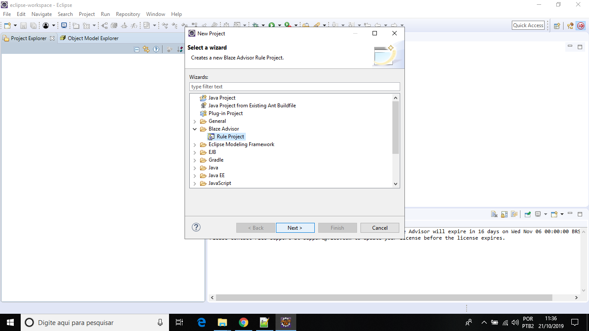

-------------------------	

- Escolher o repositório que criamos - next

-------------------------
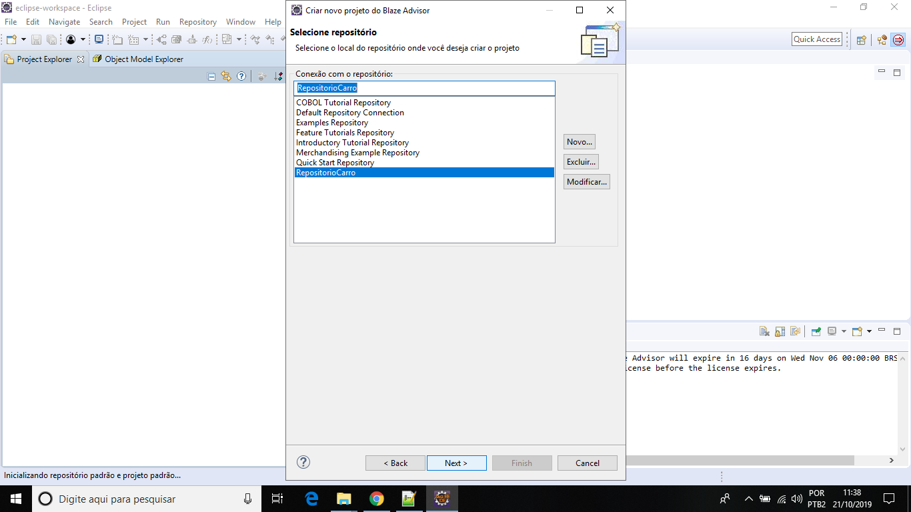

-------------------------	

- Selecionar o repositório e colocar o nome do projeto: Technical Library

-------------------------
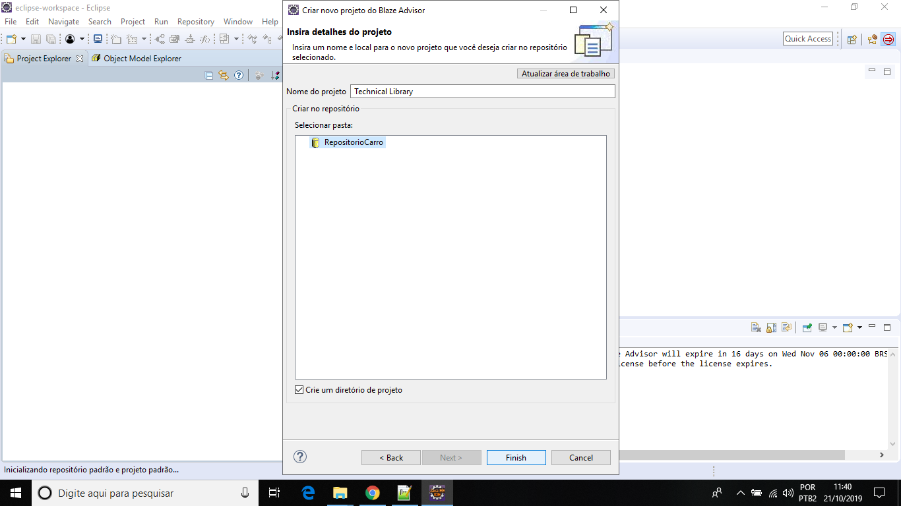

-------------------------				

- Finish.

## Business Object Model (BOM)

Neste tutorial iremos utilizar um arquivo.jar para importar as classes e as variáveis que iremos utilizar. 
Em um projeto Blaze você deve preparar com antecedência um rol de variáveis que irá trabalhar. 
Neste projeto iremos trabalhar com as seguintes variáveis:

---------------
- Variáveis de Entrada:
	- RENDA
	- SEXO
	- IDADE
	- ESTADO_CIVIL
	- NUMERO_CONDUTORES

-----------------

- Variáveis de Saída:
	- DIARIA
	- VALOR_AUTOMOVEL
	- VALOR_CAUCAO
	- CLIENT_TYPE
	- DECISION

----------------

Em um turorial à parte, irei abordar o assunto de criação de um jar e as modificações deste arquivo para o seu projeto, conforme suas necessidades. Porém, para este tutorial, iremos utilizar um arquivo.jar pronto. 

----------------

- Meu arquivo jar possui o nome de **bom-Carro3.jar**:
	
	- Colocar na pasta C:\Blaze\projetos.

----------------

- Importando o BOM.jar no projeto (eclipse):

	- Ir na aba Window - Preferences

		-------------------------
		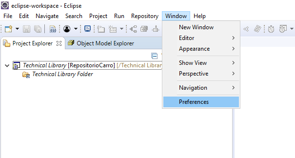

		-------------------------	

					
	- Clicar em Blaze Advisor e ir em add library [Adicionar Biblioteca]. 
	
	- Procurar pelo arquivo que salvamos na pasta projetos **bom-Carro3.jar**

		-------------------------
		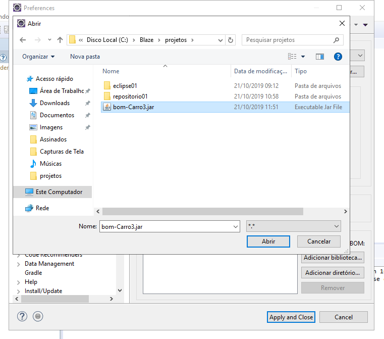

		-------------------------

					
	- Após selecioado, o arquivo aparecerá na caixa de texto localizada no canto inferior esquerdo da tela. 
		
		-------------------------
		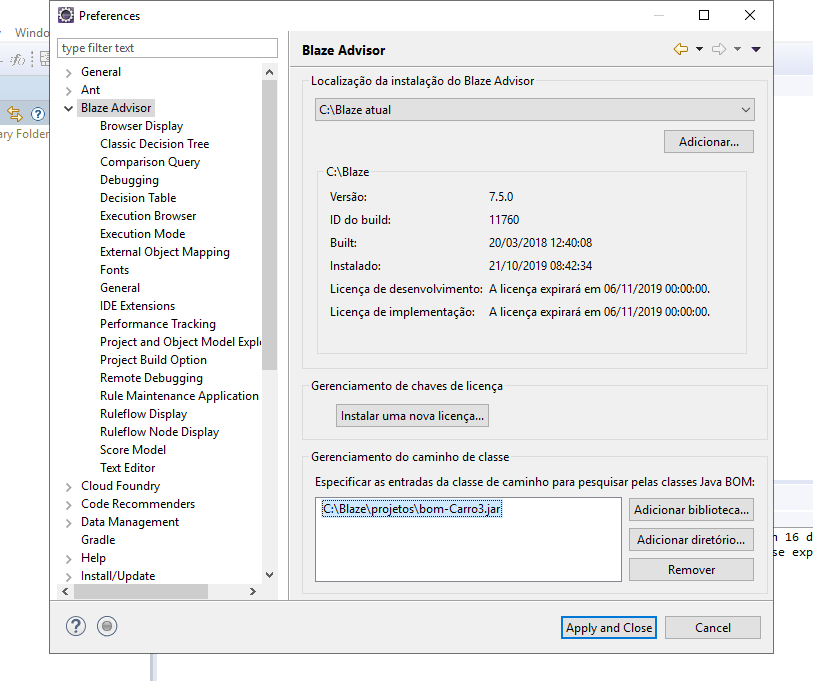

		-------------------------		
		
	- Apply and Close.
	
	
## Usando o bom-Carro3.jar

- Clicar com o botão direito do mouse sobre a pasta Technical Library.

	- New - Folder [Pasta].

	- Dar o nome de BOM.

		-------------------------
		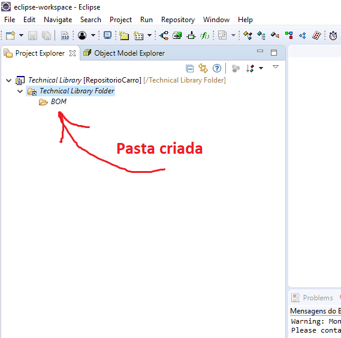

		-------------------------

	- Clicar com o botão direito do mouse sobre a pasta BOM.

	- New - Business Object Model - Modelo Java

		-------------------------
		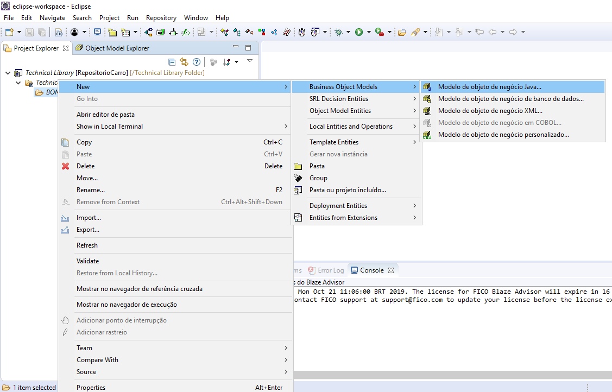

		-------------------------		

	
	- Selecionar a classe input e adicionar [Add]. 
	- Selecionar a classe output e adicionar [Add]. 

	- next - Finish[Concluir]. 

		-------------------------
		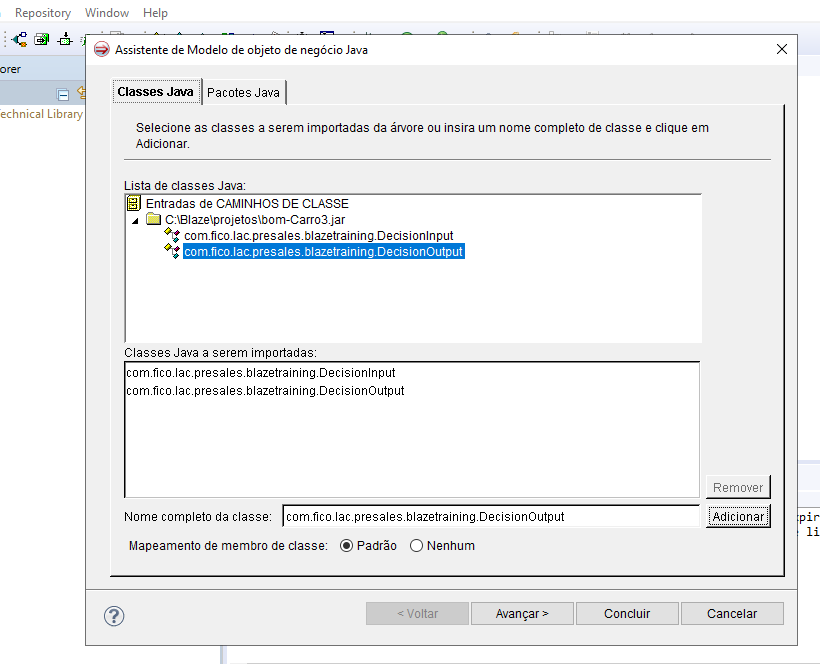

		-------------------------

	
	
	- Nota-se que dentro da pasta BOM, no editor eclipse, foi criado um arquivo [Java]. Podemos renomeá-lo para **JavaBOM** para facilitar nossa compreensão. 
					
		-------------------------
		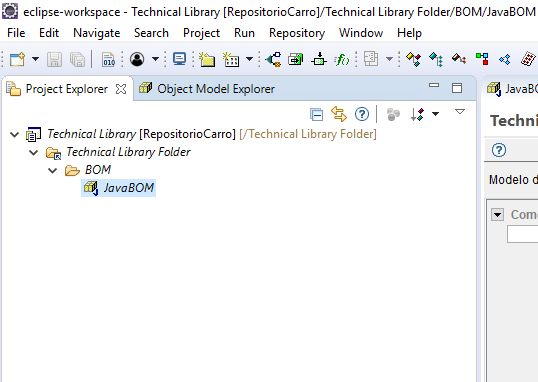

		-------------------------					
					

	- Clicar com o botão direito do mouse sobre a pasta BOM.

	- Team - Check-in.

	- Adicionar um comentário e fazer o Check-in.

		-------------------------
		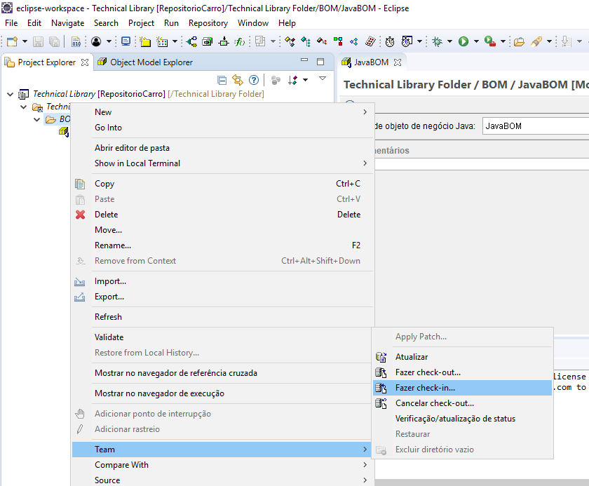

		-------------------------	

		-------------------------
		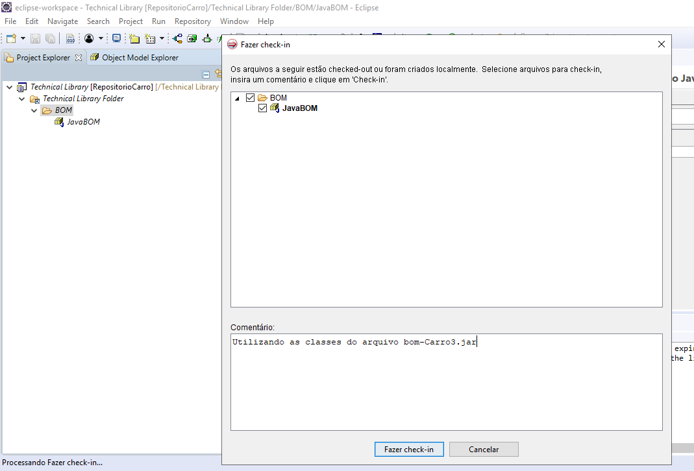

		-------------------------	

	
Obs: o tempo todo iremos utilizar as funções Check-in e Check-out.

> **Check-in:**  pode ser entendido como [SALVAR]

> **Check-out:**  pode ser entendido como [EDITAR]

## Criando Projetos [Partes]

- Business Library
	- File - New - Project - Blaze Advisor - Rule Project - Next - RepositorioCarro - Next - RepositorioCarro - name: Business Library - Finish.

-------------------------
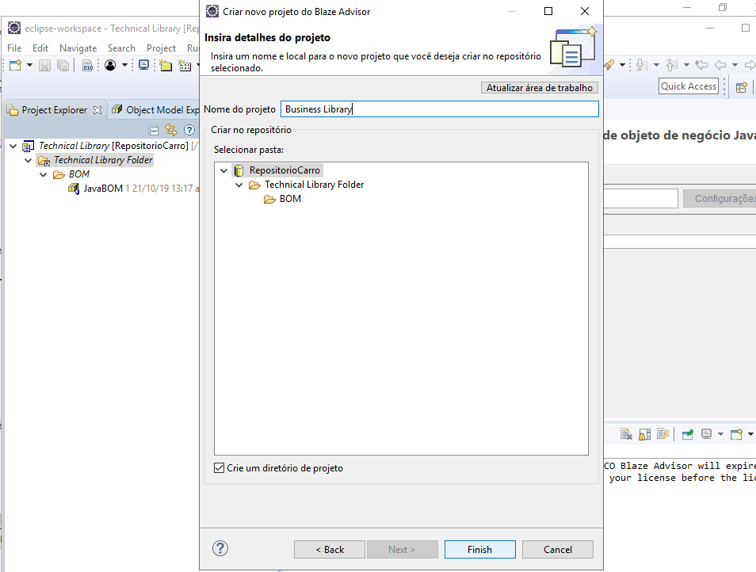

-------------------------

- Testing
	- File - New - Project - Blaze Advisor - Rule Project - Next - RepositorioCarro - Next - RepositorioCarro - name: Testing - Finish.
	
-------------------------

- Decision Services
	- Obs: a pasta Decision Services irá ganhar o nome [RegrasAluguelCarros] para tornar o projeto mais intuitivo e facilitar a identificação.  
	- File - New - Project - Blaze Advisor - Rule Project - Next - RepositorioCarro - Next - RepositorioCarro - name: RegrasAluguelCarros - Finish.

-------------------------

Após criar os projetos nosso eclipse ficará assim:

-------------------------
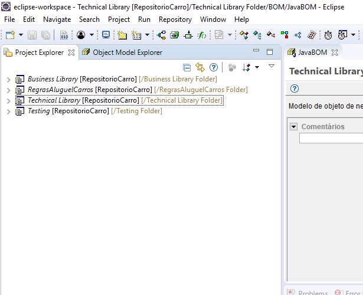

-------------------------

## Conectando os Projetos 

Para conectar todos os projetos em apenas um, basta fazer o seguinte:

- Clicar com o botão direito do mouse sobre o projeto RegrasAluguelCarros - open project editor [Abrir Editor de Projetos]

	- Na área de edição do projeto, clicar no ícone, como mostrado na imagem a seguir:
	
		-------------------------
		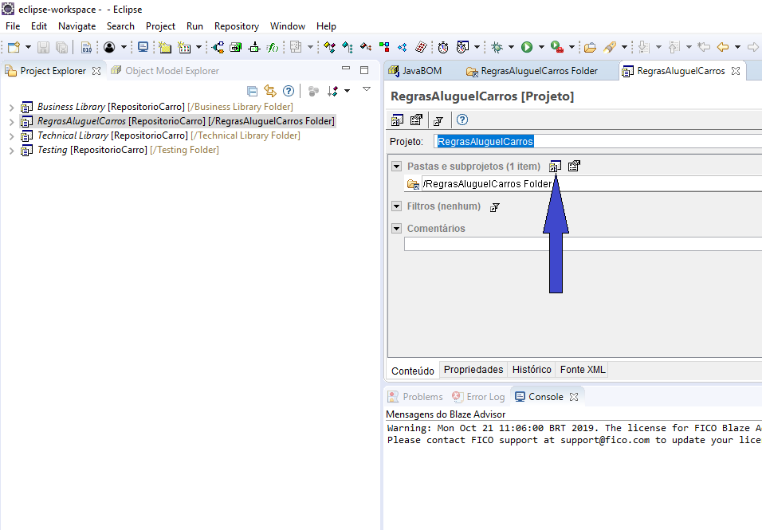

		-------------------------				
					
	- Incluir os projetos Business Library e Technical

		-------------------------
		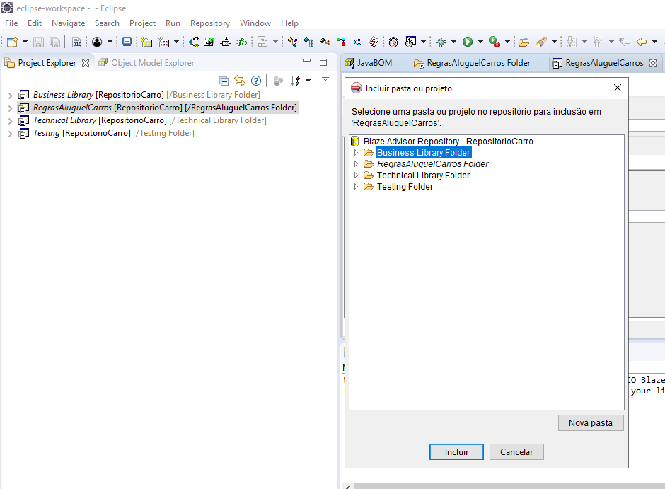

		-------------------------

		-------------------------
		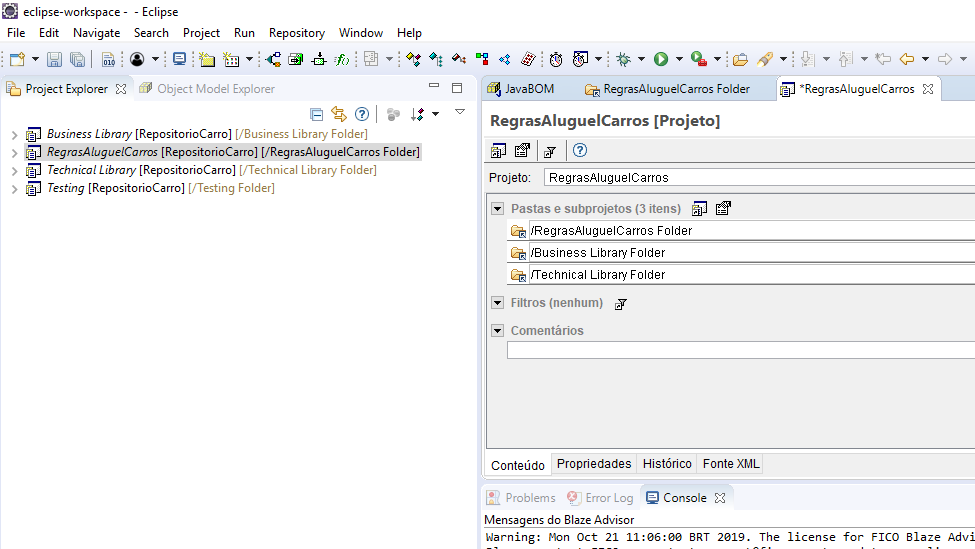

		-------------------------

	
	- Clicar no ícone Salvar, na barra superior e fazer o Check-in clicando com o botão direito sobre o projeto RegrasAluguelCarros e indo na opção team. 

	- Nota-se que agora os projetos estão conectados com o projeto RegrasAluguelCarros. 

		-------------------------
		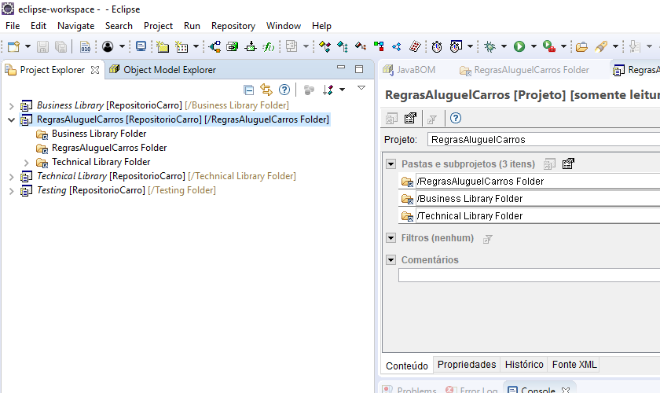

		-------------------------
				
	
	- Agora podemos fechar os projetos que estão conectados ao projeto principal, pois qualquer alteração feita no projeto principal será recursiva nos projetos que estarão fechados. 

	- Para fechar os projetos conectados ao principal basta clicar com o botão direito do mouse sobre o projeto que deseja fechar e ir na opção Close Project.
	Obs: fechar todos os projetos, deixar somente o RegrasAluguelCarros aberto. 

	- Após fechar os projetos, clicar com o botão direito sobre o projeto RegrasAluguelCarros e fazer o check-in.
	
		-------------------------
		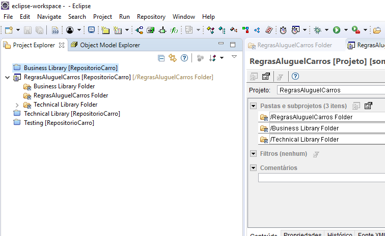

		-------------------------	

	
## RMA [Rule Maintenance Application]

Antes de iniciar as configurações, vá em:

>C:\Blaze\projetos e crie um pasta chamada adb.

- Configurações de Deploy Inicial

	- Criar uma pasta com o nome de Deploy dentro do projeto Technical. Clicar com o botão direito sobre a pasta Technical dentro do projeto principal [RegrasAluguelCarros].

		- New - Folder - Name: Deploy. 

		-----------------

	- Clicar com o botão direito do mouse sobre a pasta criada [Deploy]. 

		- New - Deployment Entities - Rule Maintenance Application Definition - Entity Name: RMADefinition - Finish.

		-------------------------
		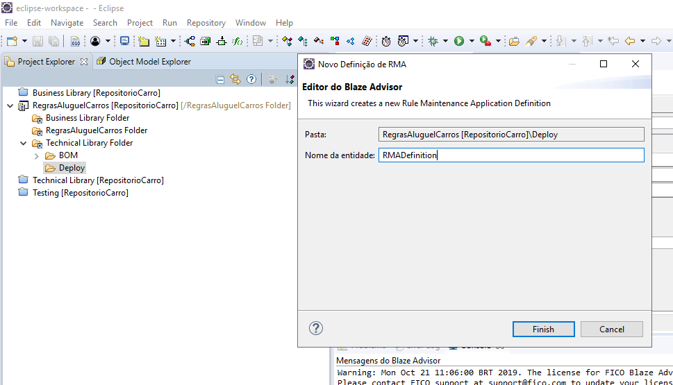

		-------------------------	

- Na aba RMADefinition: 
				
	- Application Title [Título do Aplicativo]: Regras de Aluguel de Carros

	- Habilitar as seguintes opções:
		- Download Rules Command

		-------------------------
		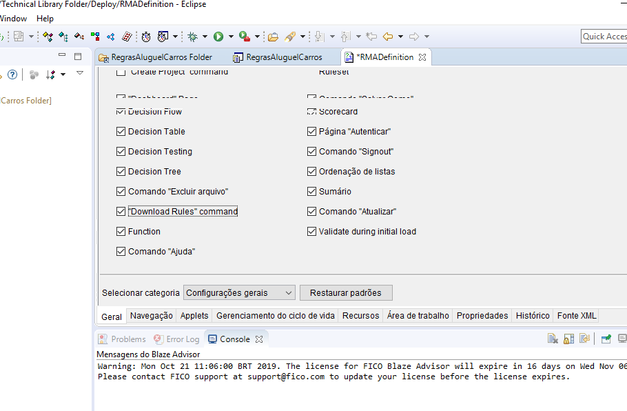

		-------------------------

					
		- Ir na aba navigate [Navegação], escolher as pastas que irão aparecer no RMA. As pastas que não vão aparecer devem ficar do lado direito. 
					
					
		-------------------------
		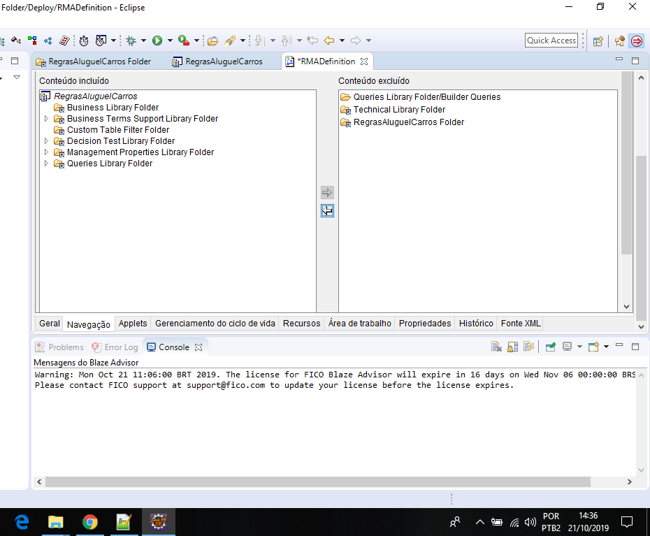

		-------------------------					
					

		
		- Ir na aba applets e marcar as opções:
			- Allow Editing of Table Name.
			- Display Branch Condition.
		
		- Ir na aba Life Cycle Management, marcar todas as opções e referenciar a pasta adb criada no início deste tópico, como mostra a imagem a seguir.

		-------------------------
		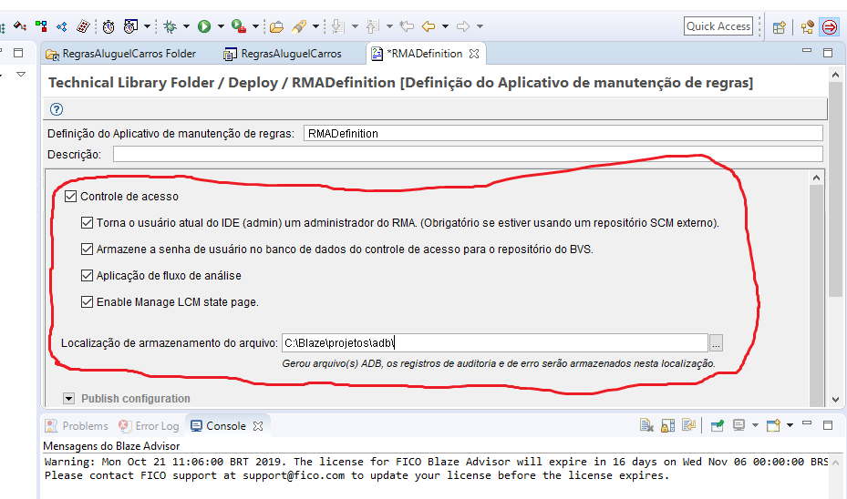

		-------------------------

					
		- Ir no ícone SALVAR ALL na barra superior do eclipse e fazer o check-in clicando com o botão direito sobre o arquivo RMADefinition que está dentro da pasta Deploy. 
	
	
## Função EntryPoint 

Criando uma função que irá "startar" o uso do fluxo de decisão no nosso RMA.

- No eclipse, clicar com o botão direito do mouse sobre a pasta Technical Library - New - Folder - Name: Entrypoint.

- Clicar com o botão direito do mouse sobre a pasta Entrypoint - New - SRL Decision Entities - Function - Name: entrypoint - Finish.
	- Name: entrypoint
	- Type: Decisioninput
	- Criar um parâmetro e o corpo de uma função.

- Obs: faça como na imagem a seguir:

-------------------------
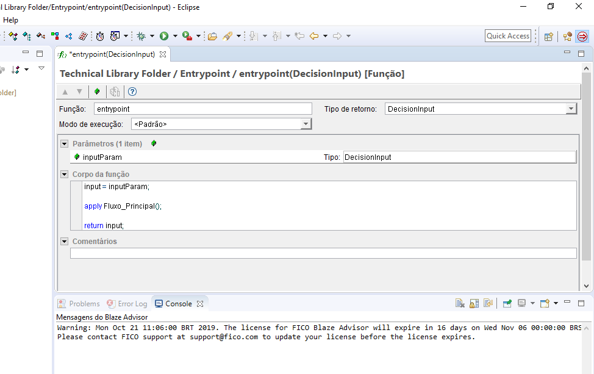

-------------------------

- Ir no ícone SALVAR e fazer o check-in neste arquivo. 

-------------------------
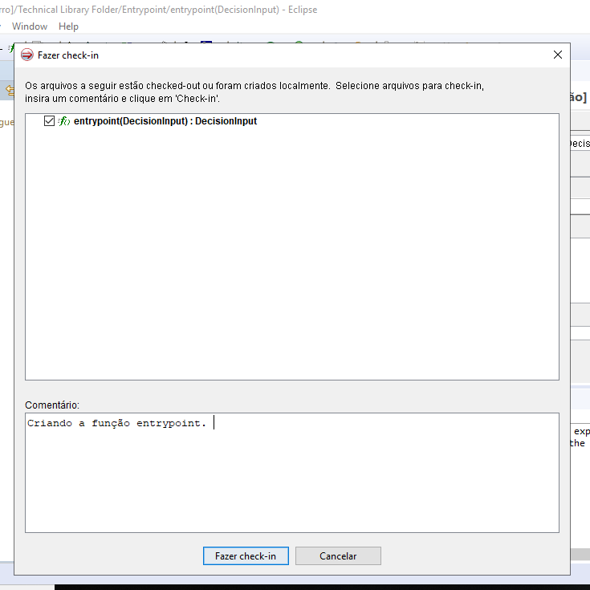

-------------------------

## Variavel Global Input 

Criando uma variável global input. 

- No eclipse, clicar com o botão direito sobre a pasta Technical [Lembrando que esta pasta está dentro de RegrasAluguelCarros].

- New - Object Model Entities - Variable
	- Nome: input

- Na tela de edição da variável:
	- Type: DecisionInput

- Fazer check-in.

## Gerar RMA [Embarcado]

- Clicar no projeto principal [RegrasAluguelCarros] e ir em:
	- Project - Rule Maintenance Application - Generate Rule Maintenance Application.

	- Este comando irá abrir uma janela pop-up chamada Gerador de Aplicativo.

	- Nota-se que o Blaze (eclipse) já reconhece o arquivo de configurações que criamos, o RMADefinition. Este arquivo configura o deploy do projeto para o RMA WEB.

	- Podemos observar também que o Blaze já reconheceu a pasta workspaces que criamos no início deste tutorial, no tópico [Criando Repositório].

	- Deixar a opção de Deploy como: 
		- Web Application.

		-------------------------
		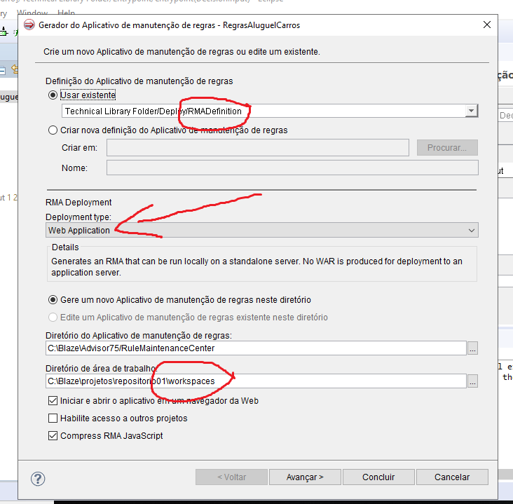

		-------------------------

	- Ao clicar em next, devemos selecionar o arquivo **bom-Carro3.jar** que criamos e anexamos ao nosso projeto e, por fim, clicar em concluir. 

		-------------------------
		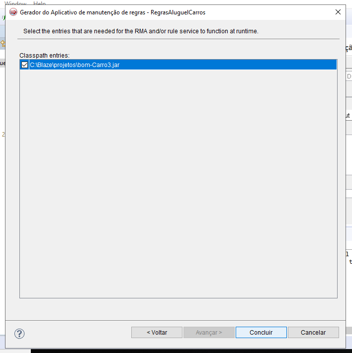

		-------------------------
	
	- O RMA irá abrir automaticamente no navegador Internet Explorer e irá utilizar o local host [http://127.0.0.1:8080] para gerar a interface. 

	- A sugestão é que você copie o link e cole em um navegador mais moderno e atualizado.

	- Se você seguiu todos os passos até aqui, basta digitar **admin** e **admin** na senha para que você acesse a interface do RMA. 

	- Clicando sobre o projeto, você estará na interface do RMA. 

		-------------------------
		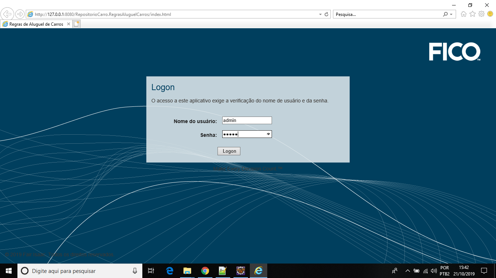

		-------------------------

		-------------------------
		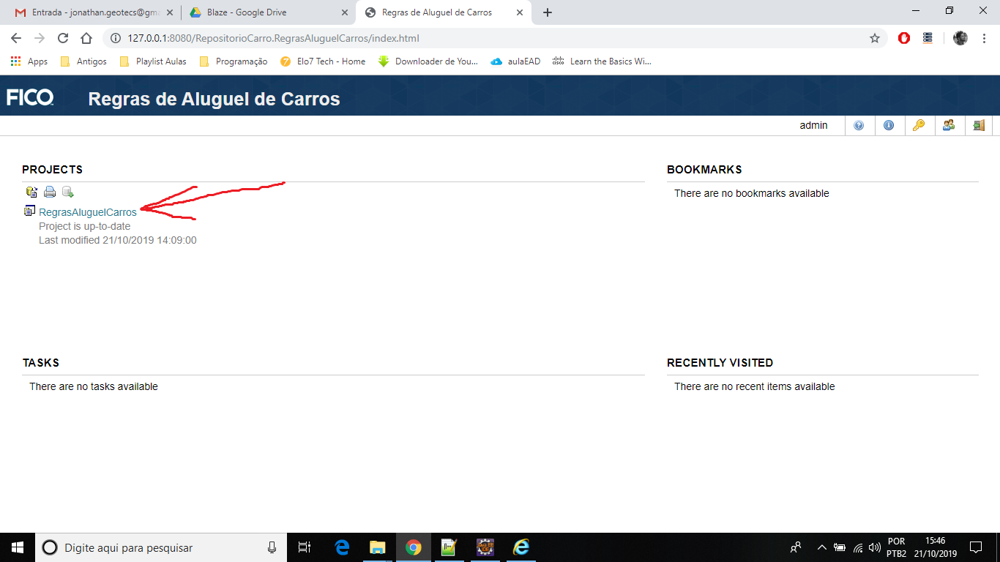

		-------------------------

		-------------------------
		
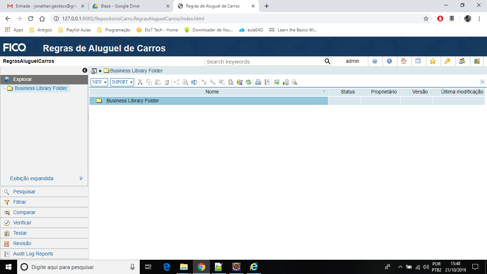

        
        

		-------------------------

## Mais Tutoriais - Blaze

- 2 Utilizando o RMA - <button onclick="window.open('/blaze-instalacao-02/');">Blaze - Utilização</button>

- 3 Deploy no Tomcat - <button onclick="window.open('/blaze-instalacao-03/');">Blaze - Deploy</button>

- 4 Tópicos Avançados - Em construção

Elaborado por:
 
Jonathan Cardoso Lopes Domingos
 
21/10/2019
